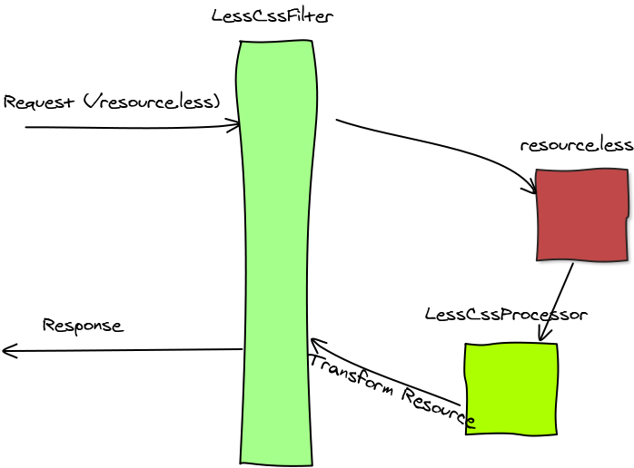

# Introduction
When you require to transform a resource on the fly, there is a filter called AbstractProcessorsFilter which can help.
The idea behind this filter, is to apply a list of any processors on a requested resource and instead of returning original resource, 
the transformed resource is written to the response.

## Creating Custom Filter
This is a  sample implementation of !AbstractProcessorsFilter:

```java
  public class CustomProcessorsFilter
      extends AbstractProcessorsFilter {
    private List<ResourcePreProcessor> list = new ArrayList<ResourcePreProcessor>();

    public CustomProcessorsFilter() {
      list.add(new FirstProcessor());
      list.add(new SecondProcessor());
    }
    
    @Override
    protected List<ResourcePreProcessor> getProcessorsList() {
      return list;
    } 
  }
```

This example uses two processors which will be applied on filtered resource. It is important to notice that the !FirstProcessor will be applied first and 
the result of the processing will be supplied as input to the !SecondProcessor. The output resulted from the last processor will be written to the response.


# Default implementations 
The AbstractProcessorsFilter is an abstract filter and require you to provide the list of processors you want to apply.
There are a couple of default implementations of this abstract filter: !LessCssFilter and !CoffeeScriptFilter. 

* LessCssFilter - transformes a less css resource into css.
* CoffeeScriptFilter - transformes a coffeeScript resource into javascript.

This image describe the work flow of the !LessCssFilter:
[](img/sketch/LessCssFilter.png)

## Usage Example
Below is an example of !LessCssFilter configuration:

```xml
  <filter>
    <filter-name>lessFilter</filter-name>
    <filter-class>ro.isdc.wro.extensions.http.LessCssFilter</filter-class>
  </filter>

  <filter-mapping>
    <filter-name>lessFilter</filter-name>
    <url-pattern>*.less</url-pattern>
  </filter-mapping>  
```

In this example, the filter is mapped to ```*.less``` extension. That means, that all resources having that extension will be transformed on the fly to css. 
You can change the mapping to something less aggressive, like: 
```<url-pattern>/static/less/*</url-pattern>```.