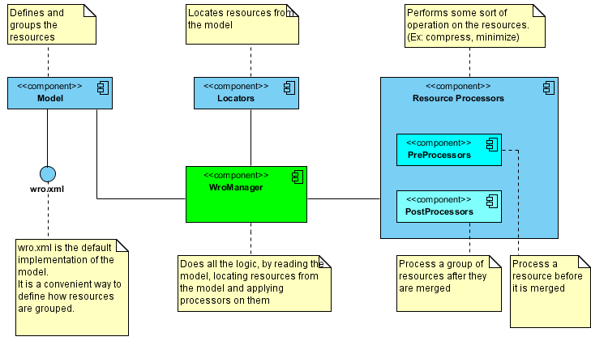
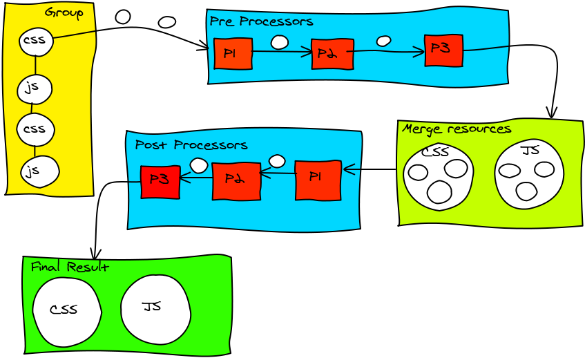

# Introduction
The building blocks of the wro4j are the following elements: [Model](WroModel), [Locators](ResourceTypes), [Processors](ProcessorsManagement) and [WroManager](WroManager). This diagrams is an overview of these elements.

This is a detailed description of each element:

## [Model](WroModel)
Model is a way to describe resources: how are they grouped and ordered. The model allows you easily manage your application resources in a centralized way.  

By default, wro4j provides several options of creating a model:  xml (more specifically wro.xml), groovy or json. It is very easy to extend the way the model is built. For example, if you don't like working with xml, you can provide a custom implementation which uses a properties files or a different DSL building a model. Alternatively you can build the model programmatically.

## [Resource Locators](ResourceTypes) 
Locators are used to retrieve the resources from virtually any possible location. By default, wro4j provides three locators: 
* classpath - used to locate classpath resources
* uri - used to locate absolute resources (using http, file, ftp protocols)
* servletContext - locates resources relative to servlet context (valid only when the runtime solution is used)

## [Resource Processors](ProcessorsManagement)
Processors are the main workers in wro4j. They do the actual resource processing. A processing can be any kind of transformation. wro4j provides a lot of built-in processors like: css minimizers, js minimizers, css url rewriter, less Css parser, sass Css parser, jsHint javascript code analyzers.)

There are two types of processors:
* Pre Processors - executed on each resource before it is merged with other resources from the group. Some of the processors doesn't make sense unless they are used as pre processors (example: css url rewriter), because the processor implementation requires information about the processed resource location.
* Post Processors - executed on the post merge phase, when all resources are merged. Basically, a post processor doesn't care about where a resource being processed is located.  

The processors also can be categorized by supported type:
* Css processors - processors which are applied only on Css resources.
* Js processors - processors which are applied only on Js resources.
* Any processors - processors which are applied on any type of resources. 

## WroManager 
WroManager is the heart of the framework. It performs all the flow:
* Read the model
* Locates the resources
* Apply _PreProcessors_
* Merge _Resources_
* Apply _PostProcessors_

This flow can be visualized in this drawing:

_NOTE_ 
This drawing was created with [Zwibbler](http://zwibbler.com/)

# Extension Points 
The wro4j framework is very flexible. You can extend any of its core elements. For instance:
* [Model](WroModel) - extend the way the model is built (groovy or any other DSL instead of xml)
* [Locators](ResourceTypes) - create a new locator capable of reading resources from a different location than the one already supported.
* [Processors](ResourceProcessors) - create a new processor which performs a better compression of the javascript (or css) code.
* WroManager - you can extend it by overriding some of the configurations, [define processor chain](ProcessorsManagement) or [cache management](ExtendingCachingImplementation).