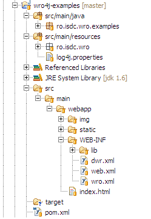

# Introduction 
The main purpose of wro4j is to provide a runtime solution for optimizing web resource. Still, if you need a build time solution, the wro4j-maven-plugin can help you to achieve this goal. 

## Eclipse IDE support
Now it is possible to use the wro4j-maven-plugin with an eclipse plugin called [m2e-wro4j](https://github.com/jbosstools/m2e-wro4j). More details about how to use it can be found on [this blog post](https://community.jboss.org/community/tools/blog/2012/01/17/css-and-js-minification-using-eclipse-maven-and-wro4j). 

# Details
There is almost no difference regarding project configuration. Thus, if you have configured your project for a runtime solution, there is almost nothing else to change. If you don't use the runtime solution, the WroFilter configuration in web.xml is not required.
A standard folder structure, which is used by wro4j maven plugin as default looks like this:

[](img/folderStructure.png)

All you have to do, is to add the following plugin dependency to the pom.xml of your web project:

```xml
<plugins>
  <plugin>
    <groupId>ro.isdc.wro4j</groupId>
    <artifactId>wro4j-maven-plugin</artifactId>
    <version>${wro4j.version}</version>
  </plugin>
</plugins>
```

This is the minimum necessary to get started. At this point, you can already start using it by running the following in command line:
```
  mvn wro4j:run -Dminimize=true -DtargetGroups=all
```
This command will generate a minimized version of all resources contained in 'all' group, for both type of resource: js & css. 

You can configure all the properties in pom.xml in order to avoid specifying parameters in command line. In this case, your plugin configuration would look like this:

```xml
<plugins>
  <plugin>
    <groupId>ro.isdc.wro4j</groupId>
    <artifactId>wro4j-maven-plugin</artifactId>
    <version>${wro4j.version}</version>
    <executions>
      <execution>
        <phase>compile</phase>
        <goals>
          <goal>run</goal>
        </goals>
      </execution>
    </executions>
  </plugin>
</plugins>
```

This is the smallest configuration with most of the parameters using default values. Eventually, you'll want to have a more advanced control over configuration. Below, you can see an example of configuration with all possible parameters set:

```xml
<plugins>
  <plugin>
    <groupId>ro.isdc.wro4j</groupId>
    <artifactId>wro4j-maven-plugin</artifactId>
    <version>${wro4j.version}</version>
    <executions>
      <execution>
        <phase>compile</phase>
        <goals>
          <goal>run</goal>
        </goals>
      </execution>
    </executions>
    <configuration>
      <targetGroups>all</targetGroups>
      <minimize>true</minimize>
      <destinationFolder>${basedir}/src/main/webapp/wro/</destinationFolder>
      <cssDestinationFolder>d:/static/css/</cssDestinationFolder>
      <jsDestinationFolder>d:/static/js/</jsDestinationFolder>
      <contextFolder>${basedir}/src/main/webapp/</contextFolder>
      <wroFile>${basedir}/src/main/webapp/WEB-INF/wro.xml</wroFile>
      <wroManagerFactory>com.mycompany.MyCustomWroManagerFactory</wroManagerFactory>
      <ignoreMissingResources>false</ignoreMissingResources>
    </configuration>
  </plugin>
</plugins>
```

## Plugin Parameters

Below is the description of parameters you can provide for the plugin:

* **minimize** - a flag used to turn minimization on or off. This parameter is optional and by default its value is true.
* **targetGroups** - (optional) a comma separated list of groups you want to build. If you do not specify this parameter, a file for each defined group will be generated. 

  A common practice is to have a single group (called 'all') which contains all other existing group. Still, if you want to build a file containing merged resources for other groups, you can do it like this: 
  ```
  -DtargetGroups=group1,group2,group3
  ```
* **wroManagerFactory** - Optional attribute, used to specify a custom implementation of MavenContextAwareManagerFactory interface. When this tag is not specified, a default implementation is used.  This attribute is useful if you want to configure other processors than default one. 

  Since 1.3.0 version, wro4j provides two new manager factories:
  
  * ```ro.isdc.wro.extensions.manager.standalone.GoogleStandaloneManagerFactory```: uses Google closure compiler for js compression
  * ```ro.isdc.wro.extensions.manager.standalone.YUIStandaloneManagerFactory```: uses YUI compressor for js compression

  Since 1.4.0 version, the following manager is available:

  * ```ro.isdc.wro.maven.plugin.manager.factory.ConfigurableWroManagerFactory``` - simplify the processors configurations using a simple property file (*wro.properties*), located by default at the following location: 
**${basedir}/src/main/webapp/WEB-INF/wro.properties**. The processors can be configured by adding the following to **wro.properties** file:

```
preProcessors=cssImport,jsMin,cssMin
postProcessors=lessCss,coffeeScript
```

You can notice that the pre processors are provided using preProcessors key and the value is a comma separated list of processors aliases. The same applies to post processors, the only difference is the key, which is postProcessors in this case.

**NOTE** 
when the ```ro.isdc.wro.maven.plugin.manager.factory.ConfigurableWroManagerFactory``` is used, the configuration provided in ```wro.properties``` will take precedence over those provided in pom.xml. 


There are also few more other parameters which can be specified inside plugin configuration in pom.xml only:

* **wroFile** - the location of wro.xml file which defines how resources are grouped. By default its value is this: ```${basedir}/src/main/webapp/WEB-INF/wro.xml``` . If you have a different project structure or a different location of wro.xml, then you should change the value of this parameter.
* **contextFolder** - defines the location of web application context, useful for locating resources relative to servletContext. By default its value is: ```${basedir}/src/main/webapp/```. Since version 1.7.2, it is possible to provide multiple context folders (csv). Example:
```contextFolder={basedir}/src/main/webapp/, {basedir}/src/main/resources/static``` In this example, two folders are used as context folders. When a resource from the model cannot be found in the first context folder, the next one will be used as a fallback. It is possible to provide multiple context folders (no limit is applied).
* **destinationFolder** - folder where the result merged resources will be created.
* **cssDestinationFolder** - folder where the css merged resources will be created
* **jsDestinationFolder** - folder where the js merged resources will be created
* **ignoreMissingResources** - if false, the build will fail if at least one resource is missing or cannot be accessed, otherwise only a warning will be displayed.
* **groupNameMappingFile** - (since 1.4.0) is an optional parameter. When provided, it should be the path to the properties file where the mapping between original group names and renamed(by [OutputNamingStrategy NamingStrategy]) are described. The generated file can be used to identify the name of aggregated bundle name.
* **extraConfigFile** - (since 1.4.0) is an optional parameter. It is used to override the location of wro.properties configuration file, which has the default location here: /WEB-INF/wro.properties.
* **parallelProcessing** - (since 1.7.1) is an optional parameter. When this flag is true and there are more than one group to be processed, these will be processed in parallel, resulting in faster overall plugin execution time. Default value: false. A similar improvement can be achieved by enable parallel preProcessing. This can be achieved by setting ```parallelPreprocessing=true``` flag in ```wro.properties```.
* **incrementalBuildEnabled** - (since 1.7.1) is an optional parameter. Default value: false. When this flag is true, the change detection will be enabled and running subsequent builds won't have any effect unless the code is changed. This flag has effect only for "run" goal. Since 1.7.2 - the linting goals (ex: jslint, jshint, csslint) also support incremental build, making lint goals much faster for subsequent builds, when small or no changes are detected.
* **contextPath** - (since 1.7.6) optional parameter which is useful for cssUrlRewriting processor to compute correct url's when the application is deployed under a context other than ROOT.


The parameters: **destinationFolder**, **cssDestinationFolder**, **jsDestinationFolder** are optional. When providing one of the following **cssDestinationFolder** or **jsDestinationFolder**, you have a more granular control over where to put the merged resources (useful when you want you css files to be located in different folder than the JavaScript). 

In other words, if aggregated resources of both types should be located in the same folder, use **destinationFolder** parameter. 
However, if you want css resources to be located in a different folder than js resource, than **cssDestinationFolder** & **jsDestinationFolder** are your friends.

Note that if you are building a war file, you can specify the target directory by prefixing the destination directory path with **${project.build.directory}/${project.build.finalName**.