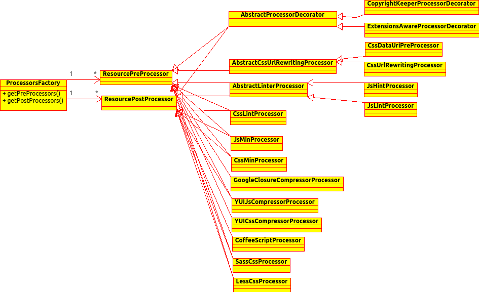

# Introduction
The pre processors are applied on each resource individually (one after another), while post processors are applied on the merged content of all resources from one group.

The processors used by **WroManagerFactory** are defined by the following interface:

```java
public interface ProcessorsFactory {
  /**
   * @return a collection of pre processors to apply.
   */
  Collection<ResourcePreProcessor> getPreProcessors();
  /**
   * @return a collection of post processors to apply.
   */
  Collection<ResourcePostProcessor> getPostProcessors();
}
```

**ProcessorsFactory** expose a way to control a collection of pre & post processors to use. The default implementation (called **SimpleProcessorsFactory**) processors are applied sequentially in the order they are defined. You can create custom implementation of this interface which can change the order processors are applied or to build the collection of processors dynamically on the runtime based on some external configuration. 

An example of custom **ProcessorsFactory** implementation, could read a properties file and set the pre & post processors based on their alias name.

## Class Diagram 
This diagram shows the classes involved in processors management. It contains the most existing classes (not all of them).
[http://wiki.wro4j.googlecode.com/git/img/uml/ProcessorsFactory.png]
[](img/uml/ProcessorsFactory.png)


# Managing processors
Controlling the processors is very easy. This is how the default factory looks like:

```java
public final class DefaultProcesorsFactory
  extends SimpleProcessorsFactory {
  public DefaultProcesorsFactory() {
    addPreProcessor(new CssUrlRewritingProcessor());
    addPreProcessor(new CssImportPreProcessor());
    addPreProcessor(new BomStripperPreProcessor());
    addPreProcessor(new SemicolonAppenderPreProcessor());
    addPreProcessor(new JSMinProcessor());
    addPreProcessor(new JawrCssMinifierProcessor());
    addPostProcessor(new CssVariablesProcessor());
  }
}
```

Here you can see that we extend the **SimpleProcessorsFactory** (which uses a list for holding processors and expose the following methods: addPreProcessor & addPostProcessor). This implementation adds several pre processors and one post processor. If you need different processors or a different order in which they are used, you can define your custom implementation.

## Configure WroManagerFactory with ProcessorsFactory =
The next step after creating a custom !ProcessorsFactory, is to instruct **WroManagerFactory to use your **ProcessorsFactory**. The default implementation of **WroManagerFactory** (called **BaseWroManagerFactory** which is a base class for most of the **WroManagerFactory** implementations) provides the **setProcessorsFactory()** method.

```java
new BaseWroManagerFactory().setProcessorsFactory(processorsFactory);
```