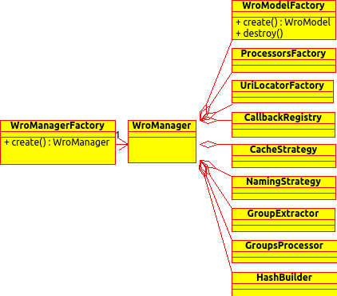

# Introduction 
**WroManager** is the core component of the wro4j framework. It does the actual processing and defines all the extension points you may need. The **WroManager** is created by a factory called **WroManagerFactory**. You can create a custom **WroManager** by creating a custom implementation of this interface.


# Details 
Implementing **WroManagerFactory** interface may be quite tedious, an easier way to create a custom **WroManagerFactory** is to extend the **BaseWroManagerFactory**. This one set all the defaults for you. 
For instance, if you want to change the way model is created, you do it this way:

```java
public class CustomWroManagerFactory
    extends BaseWroManagerFactory {
  @Override
  protected WroModelFactory newModelFactory(ServletContext servletContext) {
    return new MyWroModelFactory();
  }
}
```

If you want to provide a different processorsFactory:
```java
public class CustomWroManagerFactory
    extends BaseWroManagerFactory {
  @Override
  protected ProcessorsFactory newProcessorsFactory() {
    return new MyProcessorsFactory();
  }
}
```

Similarly, you can change **cacheStrategy**, **uriLocatorFactory** and **hashBuilder** implementations.

[](img/uml/WroManager.png)
